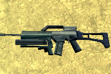
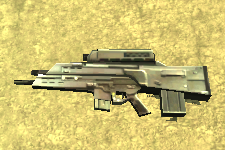
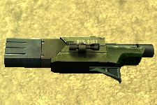

# Far Cry: Introduction to Data Science – Extract, Transform, and Load (ETL)


## Introduction

[Far Cry is a first-person shooter (FPS) video game](https://www.youtube.com/watch?v=Cz3vGM08S7Q&has_verified=1) with amazing graphics, developed by Crytek and published by Ubisoft. The game was released in 2004 for Microsoft Windows and was a huge commercial success. Ubisoft closed the online servers almost 12 years later.

Far Cry features several [multiplayer modes](https://www.youtube.com/watch?v=GaFM0uWAzh0) in which players basically score points by killing other players. One of these multiplayer modes is deathmatch, also known as free for all (FFA), where the goal is to kill (or frag, from the military term) as many other players as possible within a limited period of time. Basically, everything that moves SHOULD be killed… :)

### Multiplayer FFA Session

Players can join an online multiplayer session by connecting to a Far Cry server. A session starts for a configurable limited period of time, for example: 30 minutes, during which each player tries their best to seek out and kill other players.

When the limited period of time expires, the game stops and it displays the results of the match as an ordered leaderboard with the number of kills and deaths per player, and the efficiency of each player:


### Weapons

Players have access to a large arsenal of real-world weapons in Far Cry, from grenades and pistols, to rocket launchers, machines guns and sniper rifles. Check out [all of the weapons from good old Far Cry](https://www.youtube.com/watch?v=vzNG4VlCTFM)! They sound so cool!

| Name                                              | Code                                                  | Photo                                                  |
| ------------------------------------------------- | ----------------------------------------------------- | ------------------------------------------------------ |
| Machete                                           | `Machete`                                             |                      |
| Jungle Falcon                                     | `Falcon`                                              |                |
| Jackhammer Shotgun                                | `Shotgun`                                             |           |
| P90 SMG                                           | `P90`                                                 |                      |
| MP5 SMG                                           | `MP5`                                                 |                      |
| M4 Carbine                                        | `M4`                                                  |                   |
| AG36 Assault Rifle                                | `AG36` for the rifle, `AG36Grenade` for the explosive |           |
| OICW Advanced Assault Rifle                       | `OICW` for the rifle, `OICWGrenade` for the explosive |  |
| AW50 Sniper Rifle                                 | `SniperRifle`                                         |            |
| M249 SAW MG                                       | `M249`                                                |                  |
| Rocket Launcher                                   | `Rocket`                                              |              |
| Grenade                                           | `HandGrenade`                                         |                  |
| Mk.19 Mounted Mortar Launcher Platform            | `StickyExplosive`                                     |                       |
| Patrol Boat (when a player runs over another)     | `Boat`                                                |                 |
| Humvee or Buggy (when a player runs over another) | `Vehicle`                                             |                       |
| Rocket Launcher mounted on a vehicle              | `VehicleMountedRocketMG`                              |                      |
| Mounted Minigun                                   | `VehicleMountedAutoMG`, `MG`                          |               |
| Machine Gun mounted on a vehicle                  | `VehicleMountedMG`                                    |                       |
| Rocket Launcher mounted on a vehicle              | `VehicleRocket`                                       |                      |

_Note: AG36 Assault Rifle and OICW Advanced Assault Rifle weapons have two fire modes: automatic rifle and grenade launcher._

### Server Log: Frag History

The Far Cry server stores [log information in a text file](logs/log00.txt), starting with engine and system initialization data, followed by all the frags that occurred in every match sessions.

For example:

```bash
$ cat ./logs/log00.txt | grep killed | head
<26:32> <Lua> papazark killed lamonthe with AG36
<27:07> <Lua> theprophete killed lamonthe with Rocket
<27:18> <Lua> theprophete killed lamonthe with Rocket
<27:29> <Lua> theprophete killed lamonthe with Rocket
<27:47> <Lua> theprophete killed lamonthe with Rocket
<28:10> <Lua> theprophete killed papazark with Rocket
<28:49> <Lua> theprophete killed papazark with Rocket
<29:28> <Lua> papazark killed lamonthe with AG36
<29:36> <Lua> papazark killed lamonthe with AG36
<30:07> <Lua> theprophete killed papazark with SniperRifle
```

The format of a line corresponding to a frag, when a player kills another player, is:

```text
<MM:SS:> <Lua> killer_username killed victim_username with weapon_code
```

or the following format, when a player kills himself, e.g., when a stupid player miserably dies by throwing a grenade that eventually explodes at their feet...

```text
<MM:SS:> <Lua> killer_username killed itself
```

where:

- `MM`: Zero-padded minute between 00 and 59 of the time when the frag occurred;
- `SS`: Zero-padded second between 00 and 59 of the time when the frag occurred;
- `killer_username`: Username of the player who fragged another; can only contain letters, numbers, dashes ("`-`"), periods ("`.`"), and underscores (`_`);
- `victim_username`: Username of the player who has been fragged;
- `weapon_code`: Code name of the weapon that was used to frag the other player.

_Note: The time of a frag is relative to the time the Far Cry engine started. It represents the number of minutes/seconds elapsed between the moment the game engine started and when the frags occurred._

_Note: Players who joined a match but who hid during all the match, meaning they didn't kill anyone and they haven't been killed by anyone, don't appear in the frag history at all. We just ignore them._

You can download [Far Cry 1.34 on Windows](https://drive.google.com/file/d/1pQ5RFuQ3t669KXd_jV-2KoOONdT6NcY8/view?usp=sharing), [unzip](https://www.7-zip.org/) the archive on the disk of your computer, and run the executable `./Bin32/FarCry.exe`.


## Waypoint 1: Read Game Session Log File

Create a file `farcry.py` where you will write your code in.

Write a function `read_log_file` that takes an argument `log_file_pathname`, representing the pathname of a Far Cry server log file, and reads and returns all the bytes from the file.

For example:

```python
>>> log_data = read_log_file('./logs/log00.txt')
>>> len(log_data)
45633
```

## Waypoint 2: Parse Far Cry Engine's Start Time

The time of each frag is related to the date and time the Far Cry engine started. The latter is provided in the first line of the Far Cry log file:

```bash
$ head -1 ./logs/log00.txt
Log Started at Friday, November 09, 2018 12:22:07
```

We need to parse this date and time information to later determine the [timestamp](https://en.wikipedia.org/wiki/Timestamp) of each frag.

Write a function `parse_log_start_time` that takes an argument `log_data`, representing the data read from a Far Cry server's log file, and returns a [`datetime.datetime`](https://docs.python.org/3/library/datetime.html#datetime.datetime) object representing the time the Far Cry engine began to log events.

```python
>>> log_data = read_log_file('./logs/log00.txt')
>>> log_start_time = parse_log_start_time(log_data)
>>> log_start_time
datetime.datetime(2018, 11, 9, 12, 22, 7)
>>> log_start_time.isoformat()
'2018-11-09T12:22:07'
```

_Note 1: You can easily parse a human-readable date time such as `Saturday, March 30, 2019 09:11:31` into a `datetime.datetime` object with the function [`strptime`](https://docs.python.org/3/library/datetime.html#datetime.datetime.strptime) and the various [format strings](https://docs.python.org/3/library/datetime.html#strftime-strptime-behavior) this function supports._

_Note 2: The method [`isoformat`](https://docs.python.org/3/library/datetime.html#datetime.datetime.isoformat) returns a string representation of the date and time in the international date standard [ISO 8601](https://www.iso.org/iso-8601-date-and-time-format.html) format._

## Waypoint 3: Parse Far Cry Engine's Start Time with Time Zone


However, even the time `November 09, 2018 12:22:07` is a relative time. It is relative to the place (a location) on Earth where the related event occurred. We call this time a [local time](https://www.dictionary.com/browse/local-time).

If we had to store statistics of Far Cry match sessions that started from all over the world, we would not be able to chronologically sort them. The time expression `Saturday, March 30, 2019 09:11:31` doesn't represent the same point of time for two locations far away from each other, such as Bordeaux and Saigon.

We generally define a [time with its corresponding time zone](https://en.wikipedia.org/wiki/ISO_8601#Time_zone_designators) related to [UTC](https://en.wikipedia.org/wiki/Coordinated_Universal_Time), also known as [UTC offset](https://en.wikipedia.org/wiki/UTC_offset).

We need to retrieve the [time zone](https://en.wikipedia.org/wiki/Time_zone) of the location where a match session took place. This information is given in the Far Cry log file as a [_console variable_](https://docs.cryengine.com/pages/viewpage.action?pageId=25535264) (`cvar`) named `g_timezone`:

```bash
$ grep g_timezone ./logs/log00.txt
<18:12> Lua cvar: (g_timezone,-5)
```

_Note: You might want to parse and load all the console variables declared in the Far Cry log file into a [dictionary](https://docs.python.org/3.7/tutorial/datastructures.html#dictionaries) object. It will be easier to manipulate these settings later._

```bash
$ grep cvar ./logs/log00.txt | head -n 20
<22:08> Lua cvar: (ca_ambient_light_intensity,0.2000000029802322)
<22:08> Lua cvar: (ca_ambient_light_range,10)
<22:08> Lua cvar: (ca_EnableDecals,0)
<22:08> Lua cvar: (cl_installshieldversion,44)
<22:08> Lua cvar: (cl_lazy_weapon,0)
<22:08> Lua cvar: (cl_projectile_light,1)
<22:08> Lua cvar: (cl_punkbuster,0)
<22:08> Lua cvar: (cl_saveubipassword,0)
<22:08> Lua cvar: (cl_weapon_fx,2)
<22:08> Lua cvar: (cl_weapon_light,1)
<22:08> Lua cvar: (d3d9_TextureFilter,BILINEAR)
<22:08> Lua cvar: (e_active_shadow_maps_receving,0)
<22:08> Lua cvar: (e_beach,1)
<22:08> Lua cvar: (e_brushes_merging,1)
<22:08> Lua cvar: (e_cgf_load_lods,1)
<22:08> Lua cvar: (e_decals,0)
<22:08> Lua cvar: (e_decals_life_time_scale,0.500000)
<22:08> Lua cvar: (e_detail_texture_quality,1)
<22:08> Lua cvar: (e_flocks,0)
<22:08> Lua cvar: (e_light_maps_quality,2)
```

Update your function `parse_log_start_time` to return a [`datetime.datetime`](https://docs.python.org/3/library/datetime.html#datetime.datetime) object with time zone information.

```python
>>> log_data = read_log_file('./logs/log00.txt')
>>> log_start_time = parse_log_start_time(log_data)
>>> log_start_time
datetime.datetime(2018, 11, 9, 12, 22, 7, tzinfo=datetime.timezone(datetime.timedelta(days=-1, seconds=68400)))
>>> log_start_time.isoformat()
'2018-11-09T12:22:07-05:00'
```

## Waypoint 4: Parse Match's Map Name and Game Mode

As mentioned previously, Far Cry features several multiplayer modes:

- `ASSAULT`: There are two teams, one is defending a flag and the other team is attacking it. Each maps has 3 flags and if after 20 minutes not all flags are captured the teams switch sides. The flags are in fixed positions on the map and only one flag at a time is active;
- `TDM` (Team DeathMatch): There are two teams. Players of one team kill members of the other team;
- `FFA` (Free-For-All): Players kill anyone they can find.

There are also several maps available such as `mp_surf`, `mp_radio` and `mp_jungle` to name a few.

When you start a multiplayer session, you select which mode and map to play with. The Far Cry engine saves this information in its log file:

```bash
$ grep "Loading level" ./logs/log00.txt
<25:01> ---------------------- Loading level Levels/mp_surf, mission FFA ----------------------------------
```

Write a function `parse_match_game_mode_and_map_name` that takes an argument `log_data`, representing the data read from a Far Cry server's log file, and returns a tuple `(mode, map)`

where:

- `mode`: Indicates the multiplayer mode that was played, either `ASSAULT`, `TDM`, or `FFA`;
- `map`: The name of the map that was used, for instance `mp_surf`.

```python
>>> log_data = read_log_file('./logs/log00.txt')
>>> parse_match_game_mode_and_map_name(log_data)
('FFA', 'mp_surf')
```

## Waypoint 5: Parse Frag History

You need to write a Python function `parse_frags` that takes an argument `log_data`, representing the data read from a Far Cry server's log file, and returns a list of frags.

Each frag is represented by a tuple in the following form:

```text
(frag_time, killer_name, victim_name, weapon_code)
```

or, a simpler form, if the player committed suicide:

```text
(frag_time, killer_name)
```

where:

- `frag_time` (required): Time when the frag occurred in the format `MM:SS`;
- `killer_name` (required): Username of the player who fragged another or killed himself;
- `victim_name` (optional): Username of the player who has been fragged;
- `weapon_code` (optional): Code name of the weapon that was used to frag.

The parameter `log_file_pathname` is a path-like object giving the pathname (absolute or relative to the current working directory) of the log file.

For example:

```python
>>> log_data = read_log_file('./logs/log00.txt')
>>> parse_frags(log_data)
[('26:32', 'papazark', 'lamonthe', 'AG36'),
 ('27:07', 'theprophete', 'lamonthe', 'Rocket'),
 ('27:18', 'theprophete', 'lamonthe', 'Rocket'),
 ('27:29', 'theprophete', 'lamonthe', 'Rocket'),
 ('27:47', 'theprophete', 'lamonthe', 'Rocket'),
 ...
 ('52:43', 'papazark', 'lamonthe', 'M4'),
 ('52:43', 'lamonthe', 'papazark', 'VehicleRocket'),
 ('52:59', 'cyap', 'papazark', 'AG36Grenade'),
 ('53:09', 'cyap', 'lamonthe', 'AG36Grenade'),
 ('53:19', 'cyap', 'papazark', 'AG36')]
```

_Note: We suggest you use the function [`findall`](https://docs.python.org/3/library/re.html#re.findall) of the Python module [re](https://docs.python.org/3/library/re.htm) that provides regular expression matching operations similar to those found in Perl._

### Incongruity

Let's suppose that 3 players respectively named `Jack`, `Jack killed`, and `killed Jack`, join a Far Cry game session.

The Far Cry log file contains the following frag:

```bash
<28:12> <Lua> Jack killed killed Jack with AG36
```

Who did kill who? Did `Jack killed` kill `Jack`? Did `Jack` kill `killed Jack`? This is a special case that has no deterministic answer.

No worry. As long as your code is able to capture a guess for player names, it's okay. For example:


## Waypoint 6: Include Time Zone To Frag Timestamps

The logged time of a frag is actually truncated. Its format `MM:SS` corresponds to the minute and second of the hour in which the Far Cry engine started logging. The complete time of a frag corresponds to the time the Far Cry engine started, where hours and minutes are replaced with the logged minutes and seconds `MM:SS` of this frag.

We could use the following example: If the Far Cry engine started at `November 09, 2018 12:22:07`, the exact time of the frag log "`<26:32> <Lua> papazark killed lamonthe with AG36`" is `November 09, 2018 12:`**`26:32`**.

Rewrite the function `parse_frags` so that the time of each frag returned is a `datetime.datetime` object with a time zone.

For example:

```python
>>> log_data = read_log_file('./logs/log00.txt')
>>> parse_frags(log_data)
[(datetime.datetime(2018, 11, 9, 12, 26, 32, tzinfo=datetime.timezone(datetime.timedelta(days=-1, seconds=68400))), 'papazark', 'lamonthe', 'AG36'),
 (datetime.datetime(2018, 11, 9, 12, 27, 7, tzinfo=datetime.timezone(datetime.timedelta(days=-1, seconds=68400))), 'theprophete', 'lamonthe', 'Rocket'),
 (datetime.datetime(2018, 11, 9, 12, 27, 18, tzinfo=datetime.timezone(datetime.timedelta(days=-1, seconds=68400))), 'theprophete', 'lamonthe', 'Rocket'),
 (datetime.datetime(2018, 11, 9, 12, 27, 29, tzinfo=datetime.timezone(datetime.timedelta(days=-1, seconds=68400))), 'theprophete', 'lamonthe', 'Rocket'),
 ...
 (datetime.datetime(2018, 11, 9, 12, 52, 43, tzinfo=datetime.timezone(datetime.timedelta(days=-1, seconds=68400))), 'papazark', 'lamonthe', 'M4'),
 (datetime.datetime(2018, 11, 9, 12, 52, 43, tzinfo=datetime.timezone(datetime.timedelta(days=-1, seconds=68400))), 'lamonthe', 'papazark', 'VehicleRocket'),
 (datetime.datetime(2018, 11, 9, 12, 52, 59, tzinfo=datetime.timezone(datetime.timedelta(days=-1, seconds=68400))), 'cyap', 'papazark', 'AG36Grenade'),
 (datetime.datetime(2018, 11, 9, 12, 53, 9, tzinfo=datetime.timezone(datetime.timedelta(days=-1, seconds=68400))), 'cyap', 'lamonthe', 'AG36Grenade'),
 (datetime.datetime(2018, 11, 9, 12, 53, 19, tzinfo=datetime.timezone(datetime.timedelta(days=-1, seconds=68400))), 'cyap', 'papazark', 'AG36')]
```

**CAUTION!** When the logged time reaches `59:59`, it is reset to `00:00`. However, because Far Cry's log time unfortunately doesn't indicate hours, you MUST increment the hours by 1 yourself.

For example, the following frag logs:

```text
<59:30> <Lua> cyap killed Jack The Reaper with Machete
<59:51> <Lua> Refactorer killed cyap with VehicleRocket
<00:04> <Lua> Jack The Reaper killed cyap with M249
<00:07> <Lua> Refactorer killed cynthia with VehicleRocket
```

MUST be parsed as:

```python
[(datetime.datetime(2019, 3, 1, 16, 59, 30, tzinfo=datetime.timezone(datetime.timedelta(days=-1, seconds=68400))), 'cyap', 'Jack The Reaper', 'Machete'),
(datetime.datetime(2019, 3, 1, 16, 59, 51, tzinfo=datetime.timezone(datetime.timedelta(days=-1, seconds=68400))), 'Refactorer', 'cyap', 'VehicleRocket'),
(datetime.datetime(2019, 3, 1, 17, 0, 4, tzinfo=datetime.timezone(datetime.timedelta(days=-1, seconds=68400))), 'Jack The Reaper', 'cyap', 'M249'),
(datetime.datetime(2019, 3, 1, 17, 0, 7, tzinfo=datetime.timezone(datetime.timedelta(days=-1, seconds=68400))), 'Refactorer', 'cynthia', 'VehicleRocket')]
```

which, for a better understanding, the human-readable form is:

```python
[('2019-03-01T16:59:30-05:00', 'cyap', 'Jack The Reaper', 'Machete'),
 ('2019-03-01T16:59:51-05:00', 'Refactorer', 'cyap', 'VehicleRocket'),
 ('2019-03-01T17:00:04-05:00', 'Jack The Reaper', 'cyap', 'M249'),
 ('2019-03-01T17:00:07-05:00', 'Refactorer', 'cynthia', 'VehicleRocket')]
```

## Waypoint 7: Prettify Frag History

[Emojis](https://unicode.org/emoji/charts/emoji-list.html) are pictographs (pictorial symbols) that are typically presented in a colorful form and used inline with text. They represent things such as faces, weather, vehicles and buildings, food and drink, animals and plants, or icons that represent emotions, feelings, or activities.

We would like to display the list of frags on the terminal screen in a funnier way, using emoji characters.

The emoji 😛 represents the killer. The emoji 😦 represents the victim. The emoji ☠ represents a suicide. The following emojis represent the different types of weapon:

| Emoji                                              | Weapon Names                                                                                                                                                                               | Weapon Codes                                                                                                                    |
| -------------------------------------------------- | ------------------------------------------------------------------------------------------------------------------------------------------------------------------------------------------ | ------------------------------------------------------------------------------------------------------------------------------- |
| [🚙](https://emojipedia.org/recreational-vehicle/) | Buggy, Humvee                                                                                                                                                                              | `Vehicle`                                                                                                                       |
| [🔫](https://emojipedia.org/pistol/)               | Jungle Falcon, Jackhammer Shotgun, P90 SMG, MP5 SMG, M4 Carbine, AG36 Assault Rifle, AG36 Assault Rifle, AW50 Sniper Rifle, M249 SAW MG, Mounted Minigun, Machine Gun mounted on a vehicle | `Falcon`, `Shotgun`, `P90`, `MP5`, `M4`,`AG36`, `OICW`, `SniperRifle`, `M249`, `MG`, `VehicleMountedAutoMG`, `VehicleMountedMG` |
| [💣](https://emojipedia.org/bomb/)                 | Hand Grenade, Mk.19 Mounted Mortar Launcher Platform                                                                                                                                       | `HandGrenade`, `StickyExplosive`                                                                                                |
| [🚀](https://emojipedia.org/rocket/)               | AG36 Assault Rifle, OICW Advanced Assault Rifle, Rocket Launcher, Rocket Launcher mounted on a vehicle                                                                                     | `AG36Grenade`, `OICWGrenade`, `Rocket`, `VehicleMountedRocketMG`, `VehicleRocket`                                               |
| [🔪](https://emojipedia.org/hocho/)                | Machete                                                                                                                                                                                    | `Machete`                                                                                                                       |
| [🚤](https://emojipedia.org/speedboat/)            | Patrol Boat                                                                                                                                                                                | `Boat`                                                                                                                          |

Write a function `prettify_frags` that takes one argument `frags`, an array of tuples of frags parsed from a Far Cry server's log file, and returns a list of strings, each with the following format:

```text
[frag_time] 😛 killer_name weapon_icon 😦 victim_name
```

or, a simpler form, if the player committed suicide:

```text
[frag_time] 😦 victim_name ☠
```

where:

- `frag_time`: Date and time when the frag occurred in the ISO 8601 format with time zone information;

- `killer_name`: Username of the player who fragged another or killed himself;
- `weapon_icon`: A [Unicode emoji character](http://unicode.org/emoji/) that represents the weapon used by the killer to slay the victim, either a boat ([🚤](https://emojipedia.org/speedboat/)), a buggy or a humvee ([🚙](https://emojipedia.org/recreational-vehicle/)), a gun or a rifle ([🔫](https://emojipedia.org/pistol/)), a grenade ([💣](https://emojipedia.org/bomb/)), a rocket ([🚀](https://emojipedia.org/rocket/)), or a machete ([🔪](https://emojipedia.org/hocho/));
- `victim_name`: Username of the player who has been fragged.

For example:

```python
>>> log_data = read_log_file('./logs/log01.txt')
>>> frags = parse_frags(log_data)
>>> prettified_frags = prettify_frags(frags)
>>> print('\n'.join(prettified_frags))
[2019-03-01 16:22:54-05:00] 😛 cyap 🔫 😦 cynthia
[2019-03-01 16:23:55-05:00] 😛 cyap 🚤 😦 Jack The Ripper
[2019-03-01 16:24:48-05:00] 😛 cynthia 🔫 😦 cyap
[2019-03-01 16:25:06-05:00] 😛 cyap 🔫 😦 cynthia
[2019-03-01 16:25:27-05:00] 😛 cyap 🔫 😦 cynthia
[2019-03-01 16:25:38-05:00] 😛 cyap 🔪 😦 Jack The Ripper
[2019-03-01 16:25:49-05:00] 😛 cyap 🔫 😦 Jack The Ripper
[2019-03-01 16:26:22-05:00] 😛 cyap 🔫 😦 Jack The Ripper
[2019-03-01 16:26:53-05:00] 😛 cyap 🔫 😦 Jack The Ripper
[2019-03-01 16:27:10-05:00] 😛 cyap 🔫 😦 Jack The Ripper
[2019-03-01 16:27:26-05:00] 😛 cyap 🔫 😦 Jack The Ripper
[2019-03-01 16:27:46-05:00] 😛 cyap 🔫 😦 cynthia
[2019-03-01 16:28:02-05:00] 😛 cynthia 🔫 😦 Jack The Ripper
[2019-03-01 16:28:09-05:00] 😛 Jack The Ripper 🔫 😦 cyap
[2019-03-01 16:28:40-05:00] 😛 cyap 🔫 😦 cynthia
[2019-03-01 16:29:19-05:00] 😛 cyap 🔫 😦 cynthia
[2019-03-01 16:30:07-05:00] 😛 cyap 🚀 😦 cynthia
[2019-03-01 16:30:29-05:00] 😛 cyap 🔫 😦 cynthia
[2019-03-01 16:31:26-05:00] 😛 cyap 🚀 😦 cynthia
[2019-03-01 16:32:14-05:00] 😛 cynthia 🔫 😦 cyap
[2019-03-01 16:32:29-05:00] 😛 cyap 🔫 😦 cynthia
[2019-03-01 16:32:40-05:00] 😛 cyap 🔫 😦 cynthia
[2019-03-01 16:32:50-05:00] 😛 cyap 🚀 😦 cynthia
[2019-03-01 16:33:04-05:00] 😛 cyap 🚀 😦 cynthia
[2019-03-01 16:33:32-05:00] 😛 cyap 🚀 😦 cynthia
[2019-03-01 16:34:35-05:00] 😦 Jack The Ripper ☠
[2019-03-01 16:34:52-05:00] 😛 cyap 🔫 😦 cynthia
[2019-03-01 16:35:01-05:00] 😛 Jack The Ripper 🚀 😦 cynthia
[2019-03-01 16:35:36-05:00] 😛 cyap 🚀 😦 Jack The Ripper
[2019-03-01 16:35:41-05:00] 😛 cyap 🚀 😦 cynthia
[2019-03-01 16:36:28-05:00] 😛 cyap 🚀 😦 Jack The Ripper
[2019-03-01 16:36:39-05:00] 😛 Refactorer 🔫 😦 cyap
[2019-03-01 16:36:44-05:00] 😛 Refactorer 🔫 😦 Jack The Ripper
[2019-03-01 16:36:51-05:00] 😛 Refactorer 🔫 😦 cyap
[2019-03-01 16:37:02-05:00] 😛 Refactorer 🔫 😦 Jack The Ripper
[2019-03-01 16:37:11-05:00] 😛 Refactorer 🔫 😦 Jack The Ripper
[2019-03-01 16:37:16-05:00] 😛 cyap 🔫 😦 Refactorer
[2019-03-01 16:37:25-05:00] 😛 cynthia 🔫 😦 Jack The Ripper
[2019-03-01 16:37:38-05:00] 😛 cynthia 🔫 😦 Jack The Ripper
[2019-03-01 16:37:55-05:00] 😦 Jack The Ripper ☠
[2019-03-01 16:38:01-05:00] 😛 cyap 🔫 😦 cynthia
[2019-03-01 16:38:12-05:00] 😛 cyap 🚀 😦 cynthia
```

## Waypoint 8: Determine Game Session's Start and End Times

When a user launches Far Cry, the Far Cry application starts to store log information in the text file name `log.txt`. This does not correspond to a game session yet.

The user selects a game mode and a map to play on, and when he launches the game session. **The game session starts when the map is fully loaded**.

| Launch Game Session                     | Load Map                                     |
| --------------------------------------- | -------------------------------------------- |
|  |  |

_Hint: in the Far Cry log's file, you will information that indicates the time it took to load the map. That's a fairly good indication that the map has been loaded... :)_

On another hand, a game session does not end when at the last frag. A game session ends just before Far Cry calculates the statistics.

For example:

```text
<13:29> ================================================================================
<13:29> == Statistics ==
<13:29> ================================================================================
<13:29> Servername: intek's Server
<13:29> Levelname: mp_surf
<13:29> ================================================================================
<13:29> == Player: ==
<13:29> ================================================================================
<13:29> Player: lythanhphu
<13:29> nKill=143
<13:29> nHeadshot=11
<13:29> nBulletShot=0
<13:29> nSelfKill=3
<13:29> nBulletHit=0
<13:29> Player: Transporter
<13:29> nKill=25
<13:29> nHeadshot=5
<13:29> nBulletShot=0
<13:29> nSelfKill=0
<13:29> nBulletHit=0
<13:29> Player: moomoo
<13:29> nKill=10
<13:29> nHeadshot=2
<13:29> nBulletShot=0
<13:29> nSelfKill=2
<13:29> nBulletHit=0
<13:29> Player: jason
<13:29> nKill=8
<13:29> nHeadshot=1
<13:29> nBulletShot=0
<13:29> nSelfKill=0
<13:29> nBulletHit=0
<13:29> Player: shogun
<13:29> nKill=21
<13:29> nHeadshot=3
<13:29> nBulletShot=0
<13:29> nSelfKill=1
<13:29> nBulletHit=0
```

Write a function `parse_match_start_and_end_times` that takes an argument `log_data` representing the data read from a Far Cry server's log file (and possibly some other arguments [you need to choose wisely](https://www.youtube.com/watch?v=oF2UrYSDb3k)), and returns the approximate start and end time of the game session.

For example:

```python
>>> log_data = read_log_file('./logs/log04.txt')
>>> log_start_time = parse_log_start_time(log_data)
>>> frags = parse_frags(log_data)
>>> start_time, end_time = parse_match_start_and_end_times(log_data, <<some-other-arguments>>)
>>> start_time, end_time
(datetime.datetime(2019, 3, 12, 12, 37, 24, tzinfo=datetime.timezone(datetime.timedelta(days=-1, seconds=68400))),
 datetime.datetime(2019, 3, 12, 12, 57, 24, tzinfo=datetime.timezone(datetime.timedelta(days=-1, seconds=68400))))
 >>> str(start_time), str(end_time)
('2019-03-12 12:37:24-05:00', '2019-03-12 12:57:24-05:00')
```

Note: it could happen that Far Cry engine crashed before the end of a game session. Then Far Cry engine doesn't provide any game statistics.

```text
(...)
<37:38> <Lua> cynthia killed Jack The Ripper with OICW
<37:55> <Lua> Jack The Ripper killed itself
<38:01> <Lua> cyap killed cynthia with OICW
<38:12> <Lua> cyap killed cynthia with OICWGrenade
<38:18> ERROR: $3#SCRIPT ERROR File: =C, Function: _ERRORMESSAGE,
error: stack overflow
stack traceback:
   1:  `index' tag method [C]
   2:  method `DrawElement' at line 1042 [file `scripts/gui/hudcommon.lua']
   3:  method `DrawGauge' at line 1970 [file `scripts/gui/hudcommon.lua']
   4:  method `DrawEnergy' at line 1506 [file `scripts/gui/hudcommon.lua']
   5:  method `OnUpdateCommonHudElements' at line 2838 [file `scripts/gui/hudcommon.lua']
   6:  function <21:file `scripts/multiplayer/hud.lua'> at line 65
```

You have basically two acceptable solutions:

1. Either your program doesn't accept this log file as the game session has been somewhat corrupted;
1. Either you program considers the game's end time as the time of the line that follows the last frag (in our previous example, this would be `<38:18> ERROR: $3#SCRIPT ERROR File: =C, Function: _ERRORMESSAGE,`).

## Waypoint 9: Create Frag History CSV File

We would like to import a frag history into a [spreadsheet](https://en.wikipedia.org/wiki/Spreadsheet) for further analysis. The spreadsheet will consist of a table of cells arranged into rows and columns.

To import our frag history data into a spreadsheet application, we need to store this data in a [CSV file](https://en.wikipedia.org/wiki/Comma-separated_values).

Write a function `write_frag_csv_file` that takes an argument `log_file_pathname` representing the pathname of the CSV file to store the frags in, an argument `frags` and an array of tuples of the frags.

Each frag is represented by a comma-separated value (CSV) string with the following form:

```python
>>> log_data = read_log_file('./logs/log04.txt')
>>> frags = parse_frags(log_data)
>>> write_frag_csv_file('./logs/log04.csv', frags)
```

```bash
$ head -10 ./logs/log04.csv
2018-11-09 12:26:32-05:00,papazark,lamonthe,AG36
2018-11-09 12:27:07-05:00,theprophete,lamonthe,Rocket
2018-11-09 12:27:18-05:00,theprophete,lamonthe,Rocket
2018-11-09 12:27:29-05:00,theprophete,lamonthe,Rocket
2018-11-09 12:27:47-05:00,theprophete,lamonthe,Rocket
2018-11-09 12:28:10-05:00,theprophete,papazark,Rocket
2018-11-09 12:28:49-05:00,theprophete,papazark,Rocket
2018-11-09 12:29:28-05:00,papazark,lamonthe,AG36
2018-11-09 12:29:36-05:00,papazark,lamonthe,AG36
2018-11-09 12:30:07-05:00,theprophete,papazark,SniperRifle
```

_Note: You MUST use the Python module [csv](https://docs.python.org/3/library/csv.html)._
